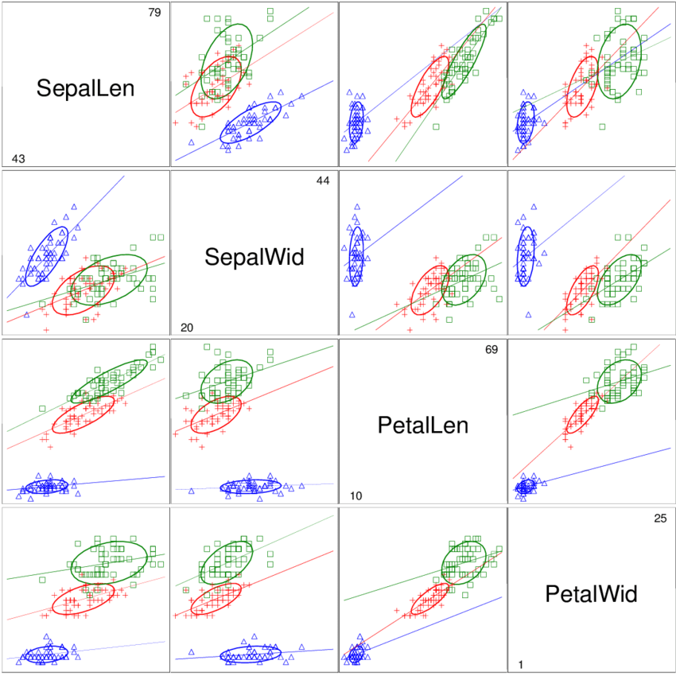

---

Aprendizagem Profunda – 2024.1

**Prof. Dr. Saulo Oliveira**

Data de Entrega: Três semanas após a definição.

Meio de Entrega: ```Relatório``` | ```Notebook```.

---

# Teoria da Probabilidade

## Parte teórica

*Faça as contas bem bonitinhas. Na mão. Quero foto. Nada digitado.*

1. Demonstre que se duas variáveis $x$ e $y$  são independentes, então sua covariância é zero.
2. Suponha que as duas variáveis  $x$ e $y$  sejam estatisticamente independentes. Mostre que a média (valor esperado) e a variância de sua soma satisfazem:
   1. $\mathbb{E}[x + y] = \mathbb{E}[x] + \mathbb{E}[y]$
   2. $\mathbb{var}[x + y] = \mathbb{var}[x] + \mathbb{var}[y]$
3. A distribuição Uniforme para uma variável contínua é definida por:
$$ \mathcal{U}(x | a, b) = \dfrac{1}{a + b}, a\leq x \leq b$$
Verifique se essa distribuição é normalizada e encontre expressões para sua média e variância.


## Parte prática

### PARTE A. Matplotlib ```(matplotlib.pyplot)``` + SciPy ```(scipy.stats.*)``` 

1. Baixe a versão do conjunto de dados [Pima Indians Diabetes](https://archive.ics.uci.edu/ml/datasets/diabetes).
2. Plote gráficos com as funções de densidade/massa de probabilidade de cada atributo. 
3. Atribua uma distribuição conhecida e faça a estimação dos parâmetros usando uma distribuição adequada. Use o conceito de máxima verossimilhança.OBS: Utilize uma distribuição já disponível no módulo SciPy. Veja a lista de distribuições disponíveis, seja ela [discreta](https://docs.scipy.org/doc/scipy/tutorial/stats/discrete.html#discrete-distributions-in-scipy-stats) ou [contínua](https://docs.scipy.org/doc/scipy/tutorial/stats/continuous.html#continuous-distributions-in-scipy-stats).
4. Repita os passos anteriores para as bases de dados da [Coluna Vertebral](https://archive.ics.uci.edu/ml/datasets/vertebral+column), também disponível no UCI Machine Learning Repository.

### PARTE B. Modelo Ingênuo de Bayes para Classificação

1. Em posse do conjunto de dados da Coluna Vertebral, crie um modelo de predição com base em uma função discriminante.  
2. Divida de forma aleatória o conjunto entre treino (80%) e teste (20%).
   1. Normalize os dados com a estratégia média e desvio padrão, somente pelos dados de treino.
   2. Treine um classificador **Naïve Bayes**, com uma distribuição para cada atributo. Lembre-se das seguintes suposições:
      1. Conhecimento à priori é com base na distribuição das classes;
      2. Independência condicional, i.e., $p\left(C_k \mid x_1, \ldots, x_d\right) \propto p(C_k) \prod^d_{i=1}p\left(x_i\mid C_k \right)$
      3. A saída é definida com base na hipótese mais provável para minimizar o erro, i.e, $\hat{y} = \underset{k=\{1,\ldots,K\}}{\arg\max} \left\{ p(C_k) \prod^d_{i=1}p\left(x_i\mid C_k \right) \right\}$.
    3. Mostre a Matriz de Confusão.
    
### PARTE C. Modelo probabilístico para Regressão

1. Em posse do conjunto de dados da Compressão de Concreto, crie quatro modelos probabilísticos para estimação da Resistência à compressão do concreto:
   1. Treine um modelo linear generalizado para realizar a estimação;
   2. Treine um estimador Nadaraya–Watson para o problema acima, com Kernel gaussiano (distribuição normal);
   3. Compare os RMSE;

### PARTE D. Amostrando dados

1. Em posse dos dados da [Coluna Vertebral](https://archive.ics.uci.edu/ml/datasets/vertebral+column), aumente o conjunto de dados de modo que cada classe passe a ter 300 amostras utilizando o método da rejeição - adote uma distribuição normal para cada atributo.
2. Faça um plot similar a este, com o antes e o depois do procesos de aumento de amostras.

 

Fonte: https://www.researchgate.net/figure/Scatterplot-matrix-of-Andersons-iris-data-showing-separate-68-data-ellipses-and_fig1_26469382.

### PARTE E. Imputando dados

1. Em posse do conjunto de dados da Íris, apague 10% dos atributos de forma aleatória, isto é, em uma matriz de $150 \times 4$, apague 180 valores;
2. Complete esses atributos com base no Valor Esperado, K-NN e por Regressão (Linear Simples).
3. Avalie os resultados com base no RMSE entre o conjunto original e o imputado.

