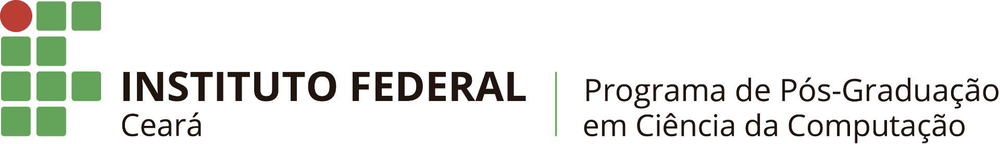
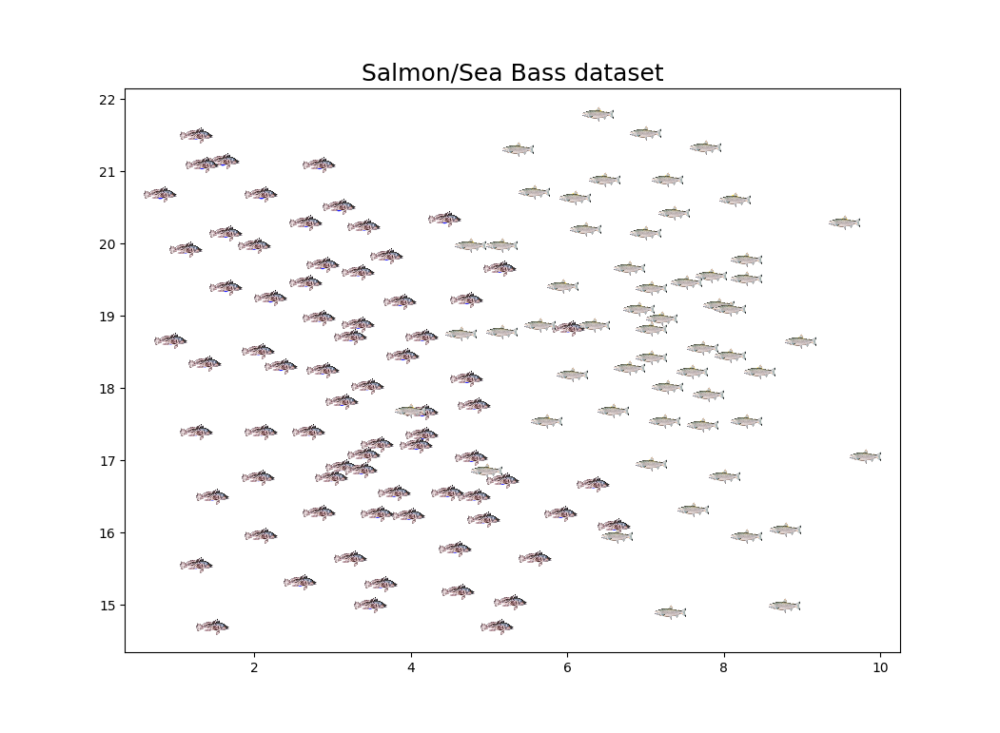

---

Aprendizagem Profunda – 2024.1

**Prof. Dr. Saulo Oliveira**

Data de Entrega: Uma semana após a definição.

Meio de Entrega: ```Relatório```.

---

# Perceptron

## Parte teórica

Busque responder aos itens abaixo com suas próprias ideias e referências (links
podem também). Evite responder de forma seca. Fundamente seu texto.

1. Defina o que é um Perceptron e elenque as diferenças de um neurônio biológico.

2. Qual o papel da taxa de aprendizagem no processo de treinamento de um
Perceptron.

3. Por que e quando precisamos ajustar os pesos de um Perceptron?

## Parte prática

4. Conjunto de dados para o exemplo de salmão/robalo do livro ```Pattern Classification 3nd ed. por Richard O. Duda, Peter E. Hart.```

- Baixe o csv do conjunto de dados (aqui)[salmon_seabass.csv];
- Implemente um Percentron (na mão mesmo, beeeem pedestre) e treine um para resolver o problema de classificação salmão/robalo;
- Mostre a matriz de confusão;
- Extraia as métricas de acurácia, precisão e revocação (*recall*).
- *EXTRA*: tente utilizar a ```matplotlib``` para mostrar a superfície de decisão do problema!




