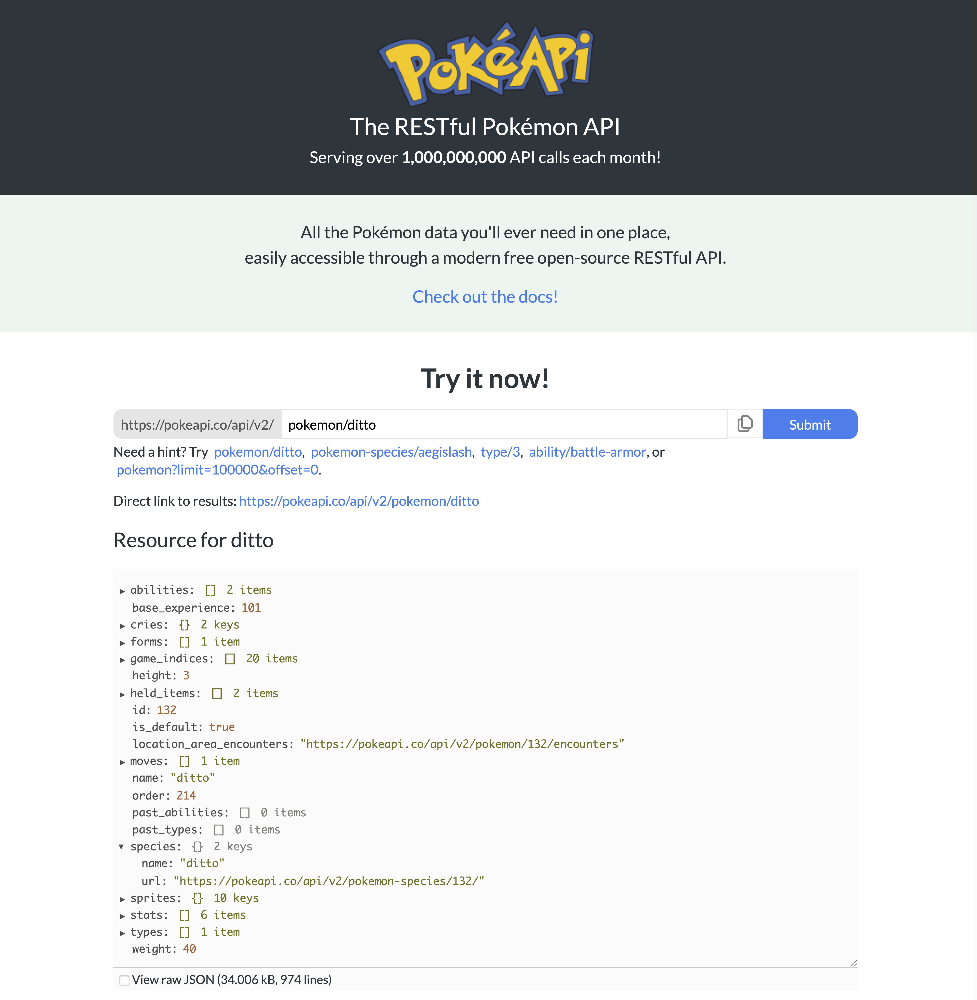

---

Aprendizagem Profunda – 2024.1

**Prof. Dr. Saulo Oliveira**

Data de Entrega: Uma semana após a definição.

Meio de Entrega: ```Colab com simulações```.

---

## Dataset: Sprites da pokeapi.co


O primeiro filme do Pokémon também foi a primeira ida ao cinema, nos anos 2000, lá no **Cinema São Luiz**, hoje, **Cineteatro São Luíz**. Uma tia minha, levou uma comitiva de 05 sobrinhos para assistir ao longa-metragem e depois lanchar no McDonalds da Rua Barão do Rio Branco. Nostalgia!

 


Pokémon moldou toda a minha infância e foi a primeira coisa que me veio à mente quando procurava um conjunto de dados interessante de pequenas imagens. Eu mesmo faço o uso da [PokeAPI](pokeapi.co) nas disciplinas de Desenvolvimento WEB e Programação para Dispositivos móveis. Eu descobri e explorei este mundo principalmente jogando uma variedade de diferentes videogames tradicionais de Pokémon, começando inicialmente no ```Pokémon Red``` (Geração 1) e terminando no ```Pokémon Emerald``` (Geração 3), tudo via emuladores -- infância reduzida em termos de recursos financeiros e telemáticos. 


Confesso que nem entendia direito o que o Mewtwo falava enquanto filosofava sobre a sua existência. Para quem não lembra, o Mewtwo era um Pokémon clonado a partir do DNA do Mew. Deixo aqui algumas de suas mais célebres falas:

> As circunstâncias do nascimento de alguém são irrelevantes. É o que você faz com o dom da vida que determina quem você é. 

> Aqueles que me criaram nunca perguntaram se eu queria existir. Por isso, eu não posso perdoá-los.

> Nós temos muita coisa em comum, a mesma terra, o mesmo ar, o mesmo céu. Talvez se começássemos a olhar para as coisas que temos em comum ao invés de diferente… Bom, quem sabe?


## O que é o trabalho?

A equipe precisará propor uma rede convolucional com uma das arquiteturas anteriormente descritas e estimar o peso do Pokémon, isto é, a rede deverá aprender o peso dos bichinhos. Tem um campo ```weight``` na resposta da PokéAPI.



A avaliação do resultado deverá contar com quatro métricas de desempenho que correlacionam as saída da rede e os valores subjetivos (de pessoas), a saber, 

- O Erro quadrático médio (RMSE);
- O coeficiente de correlação linear de Pearson (LLC);
- O coeficiente de correlação de ordem de classificação de Spearman (SRCC);
- A razão de outlier (OR); e por fim

e o tamanho do modelo (número de parâmetros traináveis).

```python
import torch
from torchmetrics import SpearmanCorrCoef, PearsonCorrCoef, MeanSquaredError

def count_parameters(model):
    return sum(p.numel() for p in model.parameters() if p.requires_grad)

def outlier_rate(scores):
    std, mean = torch.std_mean(scores)

    outilers = torch.logical_or(
            scores < (mean - 2 * std),
            scores > (mean + 2 * std)
    )    
    
    return torch.mean(outilers.double())
```
 
 De modo que o desempenho deve ser avaliado conforme as seguinte métricas:
 ```python
 import torch
 from torchmetrics import SpearmanCorrCoef, PearsonCorrCoef, MeanSquaredError
 
 y_pred = torch.tensor([3, -0.5, 2, 7]) # suponha que veio do modelo
 y = torch.tensor([2.5, 0.0, 2, 8]) # suponha que veio dos arquivos do dataset

 pearson = PearsonCorrCoef()
 spearman = SpearmanCorrCoef()
 mse = MeanSquaredError()
 
 print("Root Mean Square Error (RMSE):", mse(y_pred, y) ** 0.5)
 print("Pearson (LLC):", pearson(y_pred, y))
 print("Spearman (SRCC):", spearman(y_pred, y))
 print("Outlier Rate (OR):", outlier_rate(y_pred))

 ```
 
## Regras gerais

A seguir, as regras que delimitam os aspectos desse projeto:

- Utilizem os dados da segunda geração em diante, do 152º ao 1015º, para treino e os da primeira geração, do 1º ao 151º, para teste;
- Não pode usar rede treinada, ou seja, o treinamento tem que partir de vocês;
- Não pode fazer aprendizagem por transferência;
- Não pode pré-processar a imagem, com exceção de transformações de escala dos pixels ou redimensionamento da entrada;
- O treinamento tem de ser via Google Colab.
 
## Prêmio

Os membros da equipe vencedora (a arquitetura com melhor desempenho nas métricas acima) terão a atividade da disciplina que possuir o menor desempenho  **eliminada** da **nota final** da disciplina. Ao passo que ao não entregar um trabalho *consistente*, a nota desta atividade refletirá a qualidade da entrega.
