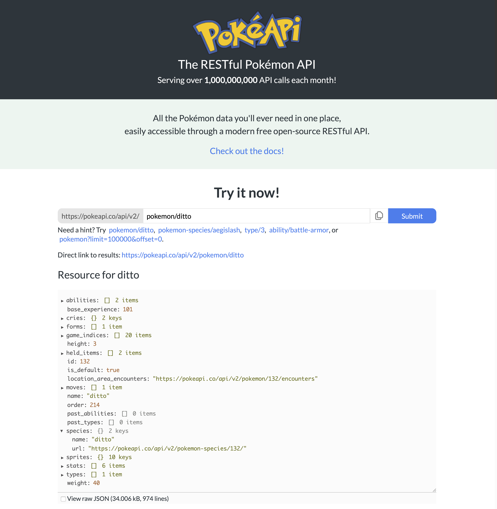

---

Aprendizagem Profunda – 2024.1

**Prof. Dr. Saulo Oliveira**

Data de Entrega: Até o final de maio.

Meio de Entrega: ```Colab com simulações```.

---

## Dataset: Sprites da pokeapi.co

Ainda é sobre Pokémon!


## O que é o trabalho?

A equipe precisará propor uma rede neural autocodificadora variacional com uma das arquiteturas anteriormente descritas para gerar novos Pokémons a partir de um espaço latente.



A avaliação do resultado conta com duas funções, o RMSE para treino e o tamanho do espaço latente.

- A raiz do erro quadrático médio (RMSE);

e o tamanho do modelo (número de parâmetros traináveis).

```python
import torch
from torchmetrics import MeanSquaredError

def count_parameters(model):
    return sum(p.numel() for p in model.parameters() if p.requires_grad)
```
 
 Na avaliação, será pedido para apresentar os valores de função de perda, bem como gerar 04 Pokémons ao vivo.
 
## Regras gerais

A seguir, as regras que delimitam os aspectos desse projeto:

- Pode utilizar todo o dataset;
- Não pode usar rede treinada, ou seja, o treinamento tem que partir de vocês;
- Não pode fazer aprendizagem por transferência;
- Agora, pode pré-processar a imagem (usem somente em tons de cinza);
- O treinamento tem de ser via Google Colab.
 
## Prêmio

Sem prêmios desta vez. Só trabalho mesmo.